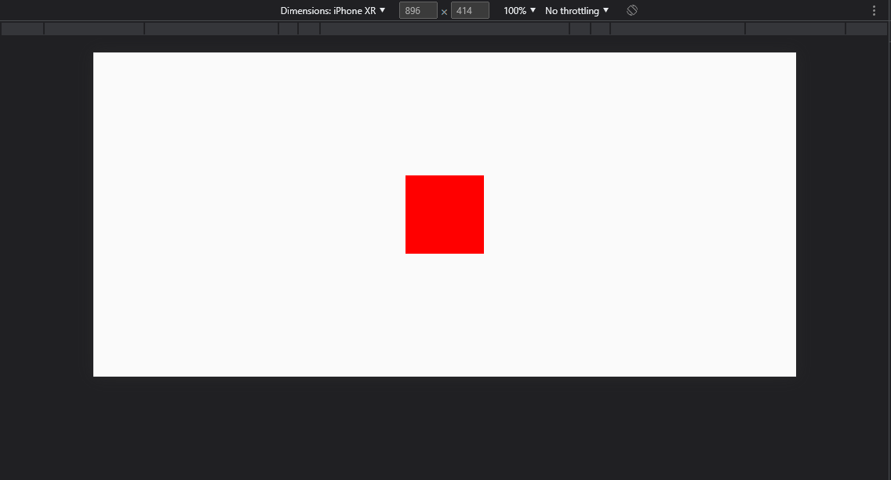

# Getting Started

- Fork this repo
- Work on the requirements
- Send a link of your repo to u18074848@tuks.co.za

## Given

You are provided a bare bones React TypeScript project. It has a single red square on the center of the page.

_You may assume it will be tested in horizontal mode in the browser's dev tools._

## Requirements

You need to add very simple functionality to this square. However, there is a constraint - You are building this for mobile, thus you may not rely on keyboard or mouse buttons. All interaction with the square must use touch gestures.

- The square needs to be able to change colour
- The square needs to be able to change shape
- The square needs to be able to change size
- A user needs to be able to add a label to the shape
- The shape needs to be able to move around the screen by dragging
- You need to be able to duplicate the shape

This assessment will not be testing whether or not you can perform these basic tasks. It will be assessing _how_ you perform them and how good the user experience is.

## Learn More

You can learn more in the [Create React App documentation](https://facebook.github.io/create-react-app/docs/getting-started).

To learn React, check out the [React documentation](https://reactjs.org/).
